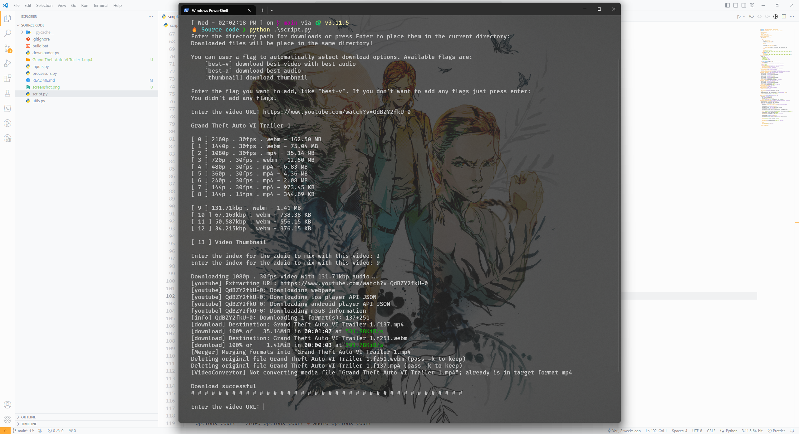

# Python YouTube Video Downloader

This Python application allows users to download videos, audio, and thumbnails from YouTube. It utilizes the `yt_dlp` library to extract video details, select the desired format, and manage the download process.

## Requirements

-   Python 3.x
-   yt_dlp library

## Features

-   Download video, audio, and thumbnails from YouTube.
-   Choose quality for video and audio downloads.
-   Use flags for automated download quality selection.
-   Specify output directory for downloads.

## Usage

1. **Start the Application**: Run the script to initiate the application.
2. **Specify Output Directory**: Enter the directory path for downloads or press Enter to use the current directory.
3. **Select Flags (Optional)**: Use flags for automated quality selection:
    - `best-v`: Automatically selects the best video and audio quality for each link.
    - `1080p`: Automatically selects 1080p video and best audio quality for each link. If there is not 1080p quality selects the best video and audio quality.
    - `best-a`: Automatically selects the best audio quality.
    - `thumbnail`: Automatically downloads the thumbnail of the video.
    - Press Enter without inputting a flag to choose download options manually for each link.
4. **Input Video URL**: When prompted, enter the YouTube video URL.
5. **Select Format**: If no flags are used, choose from provided video and audio formats.
    - Video format selection also requires selecting an accompanying audio format.
    - Audio-only selection downloads only the audio.
    - Option available to download the video thumbnail.
6. **Download**: The selected content will be downloaded to the specified or current directory.

## Customization

-   **Audio Only**: Uncomment the postprocessor section in `download_audio()` to download audio exclusively in MP3 format.

## Error Handling

-   Checks for valid YouTube URLs and format selections.
-   Displays messages for invalid inputs or errors.

## Looping Mechanism

-   The application can process multiple downloads in one session, restarting after each download.
